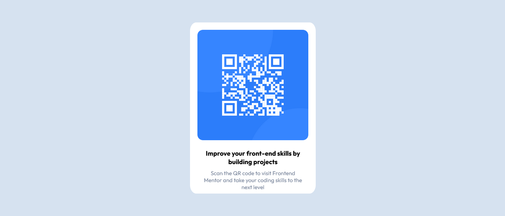

# Frontend Mentor - QR code component solution


This is my solution to the QR Code challenge on [Frontend Mentor](https://www.frontendmentor.io/challenges/qr-code-component-iux_sIO_H). Frontend Mentor is a website that provides challenges and projects to help beginner web developers learn the fundamentals in a fun way.

## Table of contents

- [Overview](#overview)
  - [Screenshot](#screenshot)
  - [Links](#links)
- [My process](#my-process)
  - [Built with](#built-with)
  - [What I learned](#what-i-learned)
  - [Continued development](#continued-development)
  - [Useful resources](#useful-resources)
- [Author](#author)
- [Acknowledgments](#acknowledgments)


## Overview

### Screenshot



The above screenshot was taken using Firefox browser

### Links

- Solution URL: [Solution GitHub](https://github.com/VincentX33/qrdisplay/)
- Live Site URL: [Live Site](https://vincentx33.github.io/qrdisplay/)

## My process

### Design

Taking into consideration all that I'm familiar with so far, the site was designed using flexbox display, and basics of css. Had to google how to centre the div right in the middle of the page, but other than that, it was a pretty easy challenge. Used external css stylesheet in contrast to the inline css utilized in the demo.

#### Topics Utilized: 
- CSS
- Flexbox

### What I learned from this

So far in my journey as a developer, I hadn't really worked on a proper project. As such, the structuring of images, folder management etc, as well as the readme writing, is a first.

Particularly, these six lines of code inside the flexclass are the heartbeat of the site:
```
.flexclass {
    display: flex;
    justify-content: center  ;
    align-items: center;
    width: 99vw;
    height: 95vh;
}
```

### Continued development
Centering a div when there is no text below is well and good, but I'm excited to try what I learnt here for the creation of a custom header

### Useful resources


- [GeeksForGeeks](https://www.geeksforgeeks.org/how-to-center-a-div-using-flexbox-property-of-css/) -Helped me understand how to horizontally and vertically center my div
- [freecodecamp](https://www.freecodecamp.org/learn/responsive-web-design)  -Partly learnt the basics here
- [W3Schools](https://www.w3schools.com/css/default.asp)- Learnt CSS from here


## Author

- ## Vincent Dsouza
- Frontend Mentor - [@VincentX33](https://www.frontendmentor.io/profile/VincentX33)
- Twitter - [@V1nceeeent](https://twitter.com/V1nceeeent/)
